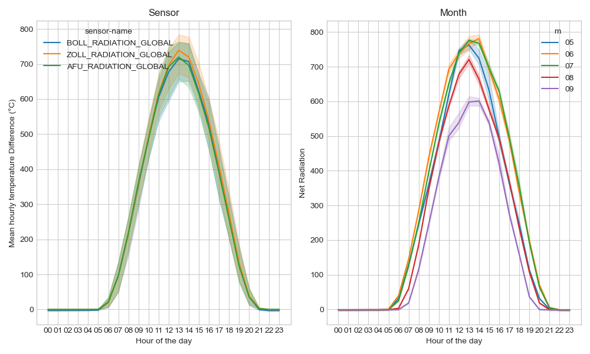
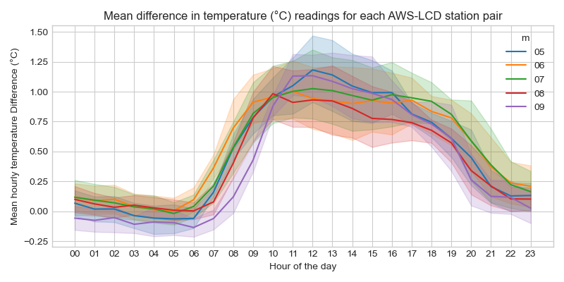
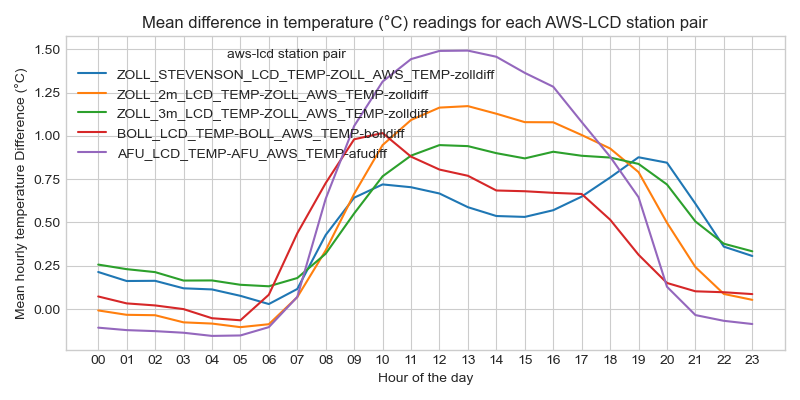
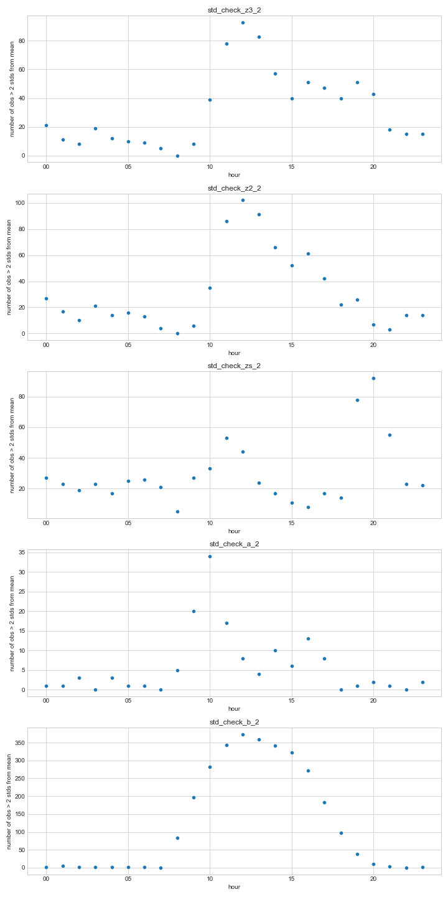
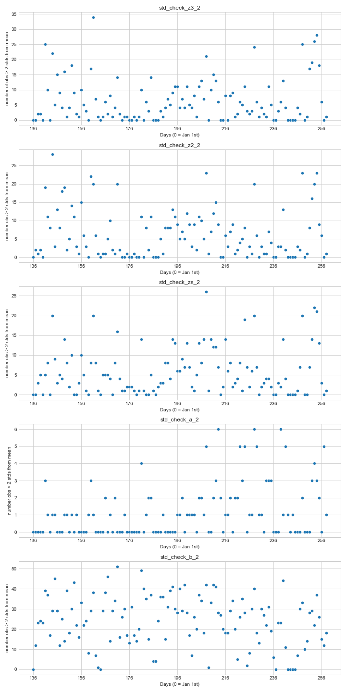
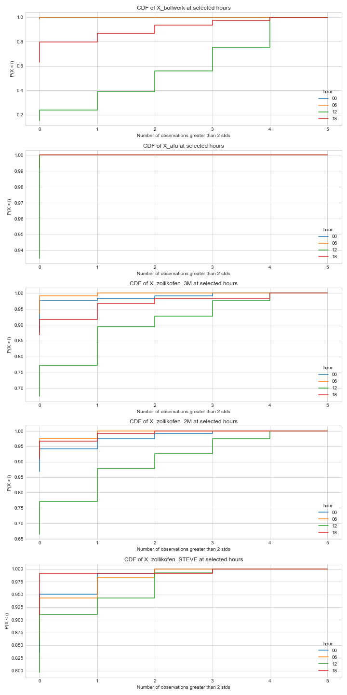

# How likely is the difference between AWS and LCD sensors to diverge signficantly from the mean?

This notebook prepares the raw data from the 2018 sensor reference data set and uses it to construct the following random variable to analyzse how the difference between station control measurements evolve through time.

## Theory and definition of random variable

Let $(x_{i},y_{i})$ represent measurements from a given AWS and LCD station pair at a given point in time $i \,\, \in \,\,I$ where $I$ is the set of all observation pairs with complete data. Let $\overline{xy_{i}}$ and $\sigma_{xy_{i}}$ be the mean difference and standard deviation of this difference between aws and lcd measurements for all pairs of observations $(x_{i},y_{i})$.

Define the discreet Random Variable $V$ where $V =$ (the number of observations that exceed a given number of standard deviations for a given time period). This can be written as $g_{k}(x_{i},y_{i})\,\, \forall \,\, (x_{i},y_{i} \,\,\in (X,Y)\,\, \forall \,\,k \,\, \in \,\, K$ where $K$ is the set of all time groupings and $k$ is the set of observations $i$ within each time grouping. This be written as the following for an arbitrary number of standard deviations $c$ set as the cut off limit for success.

$$g_{k}(x_{i},x_{j}) = 1 \,\, if \,\,  \frac{x_{i} - y_{i} - \overline{\rm xy_{i}}}{\sigma_{xy_{i}}} > c $$
$$g_{k}(x_{i},x_{j}) = 0 \,\, otherwise$$

Therefore the random variable can be written as:

$$V_{k} = \sum^{i}{g(x_{i},y_{i})} \,\, \forall \,\, i \in \,\,k$$

Concretely, there are readings every 10 minutes, therefore each hour of each day can be treated as a period $k$ with 6 readings $i = (1,2,3,4,5,6)$ in each period and $range(V_{k}) = [0,6]$. Since the study period runs from May 15th - September 15th any given hour $k \,\, \in \,\, K = [0,23]$ has around 120 trials. 

If radiation drives deviations from the mean we should see the CDF for this random variable fluctuate according to the $k$ chosen (e.g. if $k = 13$ we expect a lot of radiation and thus a lot of devation from the mean, while if $k = 00$ we expect few signficant deviations fromm the mean. This notebooke implements this random variable test.

As will be shown graphically, time of day has a clear correlation with deviations from the mean, while day of the year seems to have little impact.

Interestingly the flucatuations are markedly different at each sensor site, with the Zollikofen sensors all fluctuating in a similar fashion. This test will be repeated with the 2019, 2020, and 2021 data to confirm the stability of the distribution of this random variable year on year.

## General Mean Difference Results

### Radiation
The radiation shown below for all aws stations is the most likely culprit. However, the smooth curve is not observed for all figures.

### Grouped by hours and by month
The hours show a clear evolution throught the day that is relatively unchanged when grouped by month.

### Grouped by hours and by station
Overall, the trajectories are similar across stations, but there are marked differences in their respective daily evolutions.

## Random Variable

### Hours
However, there is a difference in the trajectory of each station as can be seen in the following chart. The First three charts from Zollikofen are remarkably similar in terms of magnitude and distribution of extreme values. The second two charts are quite different and not what was expected. Namely, the Bollwork random variables vary precisely with radiation, while AFU has almost no signfiicant deviations from the mean.

### Days
As the below charts show for the number of observations with significant standard deviations (as defined in the Random Variable in the introduction) each sensor, there is not a clear overall trend as the year progresses from May 15th to September 15th.

### CDF for select hours of the day
For the scenario descibed in the introduction, the following is a chart of the outcomes of this Random Variable being realized for all observations with complete data. We see strong divergences in the CDF based on station and time of day. The station divergences are not expected as they do not correlate with the largest aws/lcd sensor differences. Notice that AFU has the highest bias and the lowest number of observations with signficant exceptions to the standard deviation.

## Quick Discussion
- The unexpected results could come from dividing by the variance. AFU has a higher highs and lower lows than other stations, and thus dividing by the variance underestimates the absolute changes in AFU values relative to the other stations.
- Selecting the std variation cut off will change results significantly, this has not been explored.
- Apply to 2019, 2020,2021 data to see if the station distinctive trends remain.

